# Лабораторна робота № 3
## Алгоритми обходу двовимірних масивів (матриць)

**Дисципліна:** Структури даних та алгоритми (СДА)  
**Мова програмування:** С

> Загальна інформація про курс (перелік робіт, система оцінювання, середовище розробки) — див. SDA_Course_Info.md / .docx.

---

## 1. Мета лабораторної роботи

Засвоєння теоретичного матеріалу та набуття практичних навичок гнучкої роботи при реалізації алгоритмів з використанням двовимірних масивів (матриць).

## 2. Постановка задачі

1. Екран монітора має площинні координати так само, як і двовимірний масив (матриця), але, на відміну від останнього, дає змогу візуально спостерігати виконання способу обходу — тому ця лабораторна робота виконується **в координатах екрана монітора**.
2. Завдання роботи — виконати заданий за варіантом спосіб обходу на екрані монітора в текстовому режимі, проставляючи довільний символ клавіатури (наприклад, `*`) у порядку заданого способу обходу.
3. Оскільки при виводі символу у правий нижній кут екрана відбувається зсув зображення на один рядок вгору (якщо не використовується прямий доступ до відеопам'яті), **останній рядок екрана заповнювати не потрібно**.

## 3. Вимоги до оформлення звіту

Обов'язково в протоколі має бути (**за відсутність нижчепереліченого знімаються бали**):

1. Загальна постановка задачі та завдання для конкретного варіанта, з рисунком заданого обходу двовимірного масиву (матриці).
2. Текст програми.
3. Тестування програми: при тестуванні необхідно уважно відстежити правильність заповнення екрана монітора символами (виконання обходу матриці) при **повільному** виводі символів (з використанням функції затримки виконання програми).
4. Окрім текстового звіту, в якості результату — продемонструвати викладачу правильність роботи програми при повільному виводі символів (наживо).

## 4. Контрольні питання

1. Класифікація масивів.
2. Запис оголошення та використання двовимірних масивів діаграмами дій.
3. Запис оголошення та використання двовимірних масивів мовою програмування.
4. Що означає термін «обхід двовимірного масиву (матриці)»?
5. Скільки циклів та індексних змінних потрібно для виконання обходу двовимірного масиву (матриці)?
6. Як визначити спосіб простого обходу (по рядках чи по стовпчиках), використаний у програмі, за виглядом заголовків циклів та використанням індексних змінних при звертанні до елементів масиву?

## 5. Методичні вказівки до виконання завдання

### 5.1 Координати екрана монітора

Екран монітора комп'ютера у стандартному текстовому режимі має **25 рядків і 80 стовпчиків**. Кутові координати: лівий верхній кут — (1,1), правий нижній — (80,25).

При правильно складеному алгоритмі зображення на екрані буде автоматично «підніматись» на один рядок угору в момент виводу символу у правий нижній кут з координатами (80,25). Тому останнім рядком, який заповнюється програмою, слід вважати **24-й рядок** (25-й рядок можна коректно заповнити лише з прямим доступом до відеопам'яті, що в цій роботі не вимагається).

### 5.2 Відмінність нумерації координат масиву та екрана

При зверненні до елемента двовимірного масиву `A[i][j]` перший індекс `i` — номер рядка (відкладається по вертикалі, вниз), другий індекс `j` — номер стовпчика (відкладається по горизонталі, вправо).

При зверненні до позиції екрана монітора (найчастіше через функцію на кшталт `gotoxy(X, Y)`), навпаки: перший індекс `X` — номер стовпчика (по горизонталі, вправо), другий індекс `Y` — номер рядка (по вертикалі, вниз).

З урахуванням цієї відмінності, в усіх інших аспектах алгоритми обходу двовимірного масиву та обходу позицій екрана монітора однакові.

### 5.3 Затримка виводу та розмір консолі — портативний підхід

Через високу швидкодію сучасних комп'ютерів екран заповнюється миттєво, тому без затримки простежити коректність обходу неможливо. Раніше тут пропонувалося писати окремий код під Windows (`windows.h`) і окремий під Linux/macOS (`ncurses`) — і для затримки, і для визначення розміру консолі, з повним дублюванням логіки під кожну ОС. Замість цього рекомендується:

1. **Позиціювання курсора та очищення екрана — через ANSI escape-послідовності.** Вони однаково працюють у Linux, macOS і сучасному Windows Terminal, без потреби у `windows.h` чи `ncurses`:
   ```c
   printf("\033[%d;%dH", row + 1, col + 1); // позиціювати курсор (координати з 1)
   printf("\033[2J\033[H");                  // очистити екран і повернути курсор у (1,1)
   ```
2. **Затримку виводу та визначення розміру консолі винести в один невеликий ізольований файл** (наприклад `platform.c` / `platform.h`) з однаковою сигнатурою для будь-якої ОС, замість того щоб розкидати `#ifdef` по всій програмі:
   ```c
   void portable_sleep_ms(int ms);               // nanosleep() на POSIX, Sleep() на Windows
   void get_console_size(int *cols, int *rows);   // ioctl(TIOCGWINSZ) на POSIX, GetConsoleScreenBufferInfo на Windows
   ```
   Реалізація цих двох функцій — єдине місце в програмі, де взагалі потрібен `#ifdef _WIN32`; решта коду (сам алгоритм обходу і вивід символів) залишається однаковою незалежно від ОС.

> **Для тих, хто хоче піти далі:** відокремлення алгоритму обходу (який просто генерує впорядкований список координат) від виводу (текстовий чи, за бажанням, графічний через бібліотеку raylib — анімована сітка кольорових квадратів замість символів) детально описано в окремому документі **Lab3_Rework_Design.md / .docx**. Це не заміна вимог цієї роботи, а можливий шлях реалізації понад мінімум — текстовий портативний варіант вище повністю задовольняє завдання.

### 5.4 Умовні позначення на схемах варіантів завдань

1. Якщо на схемі завдання зображена тільки одна спіралеподібна чи зигзагоподібна стрілка — символи на екран виводяться строго згідно зі зміною напрямків лінії стрілки та її перегинів.
2. Якщо на схемі зображені дві зигзагоподібні стрілки — символи виводяться строго згідно зі зміною напрямків обох ліній, **почергово**: перший символ згідно з першою стрілкою, перший символ згідно з другою стрілкою, другий символ згідно з першою, другий згідно з другою, і т. д.

### 5.5 На що звернути увагу (типові помилки)

1. Відступи між рядками чи стовпчиками схеми робити не потрібно: 0-й рядок та 0-й стовпчик обов'язково мають бути заповнені. У результаті виконання програми консоль має бути **повністю** заповнена символами.
2. Двічі проходити по одному й тому самому місцю **не потрібно** — це помилка.
3. Відступу згори теж не має бути — перший рядок має бути заповнений.
4. «Виліт» за межі прямокутника, який треба обійти (за межі консолі), — це теж помилка.
5. У методичці про роботу з консоллю писалося для мови Pascal; мовою С це робиться дещо інакше (див. конспект лекцій та розділи 5.3–5.4 вище).
6. Вручну обчислювати проміжні координати і хардкодити їх у програмі — погано. Так само погано вручну обчислювати точку зупинки — це має робити програма. Єдині числа, які можна явно прописувати, — це розміри масиву, який треба обійти, та (опційно) координата верхнього кута, і краще виносити їх у константи (або отримувати за допомогою бібліотечних функцій), а не прописувати прямо в циклі.
7. Заповнювати можна або прямокутник 80×24, або всю консоль — але для другого варіанта розміри треба отримувати програмно, як описано в розділі 5.4.

## 6. Варіанти індивідуальних завдань

Стрілками на схемах показано напрямок і траєкторію обходу матриці; кружком позначено початкову точку обходу.

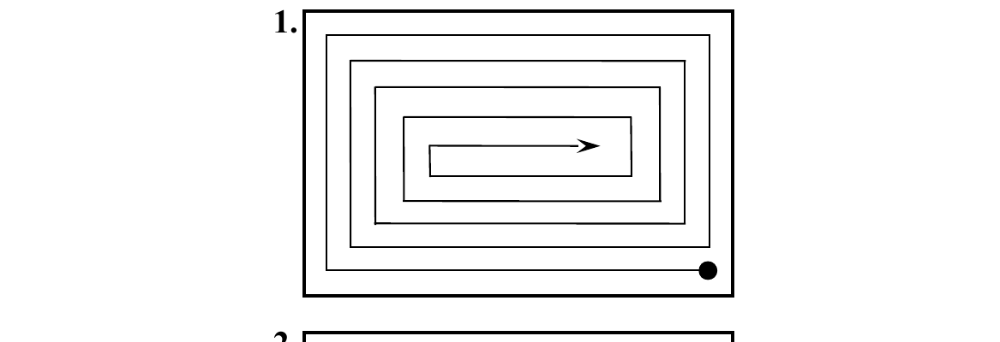

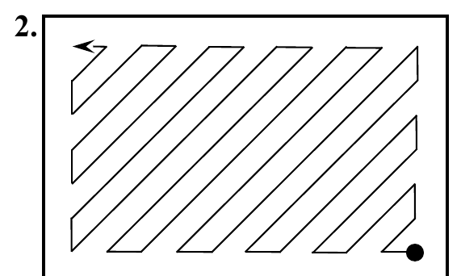

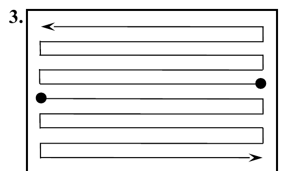

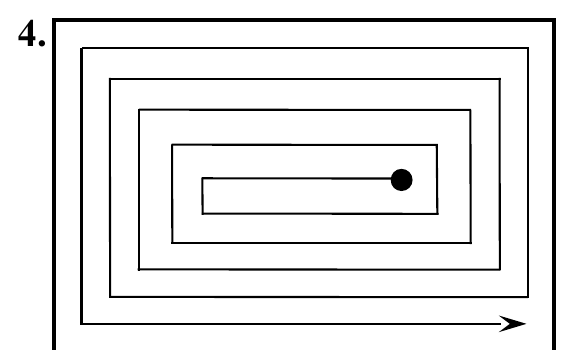

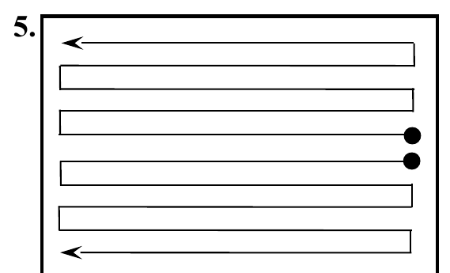

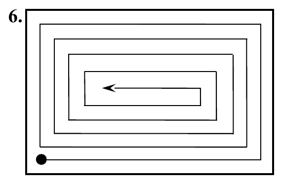

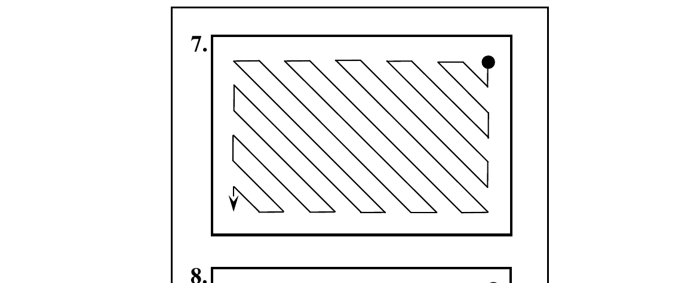

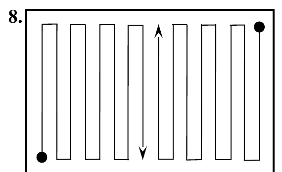

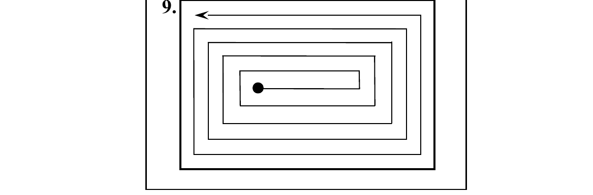

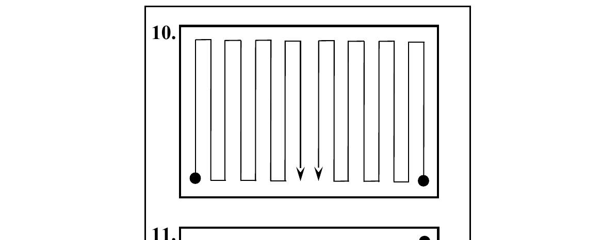

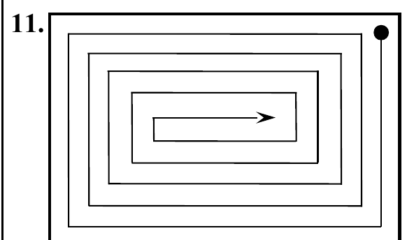

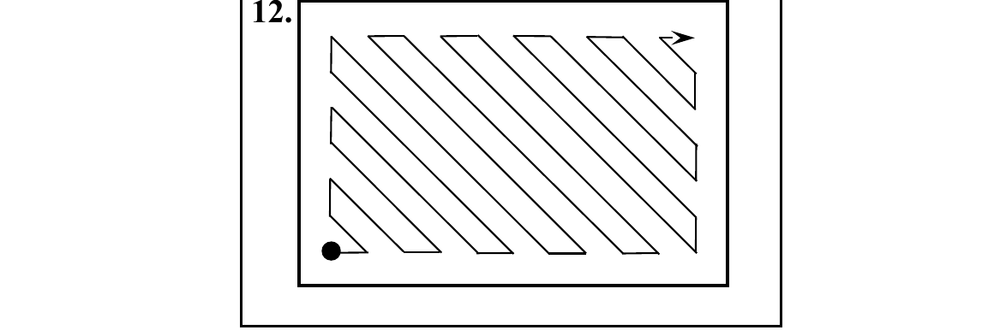

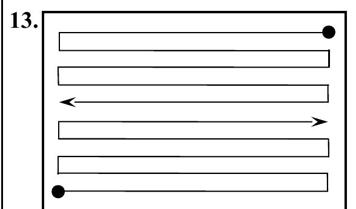

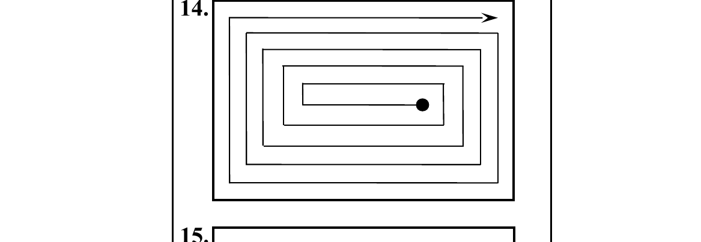

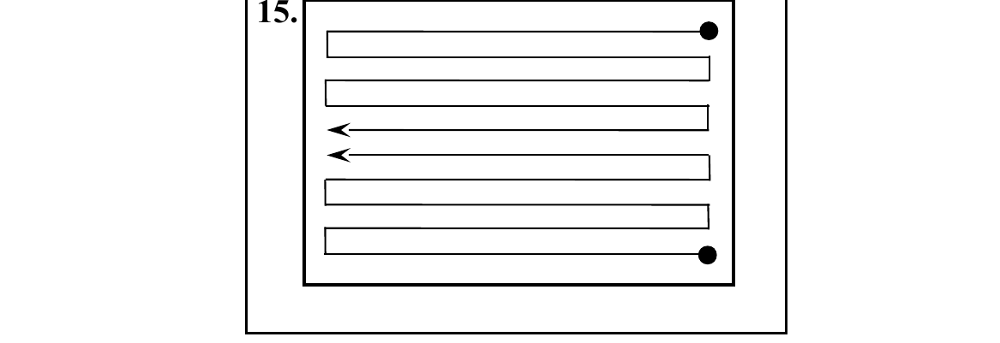

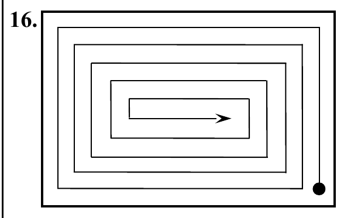

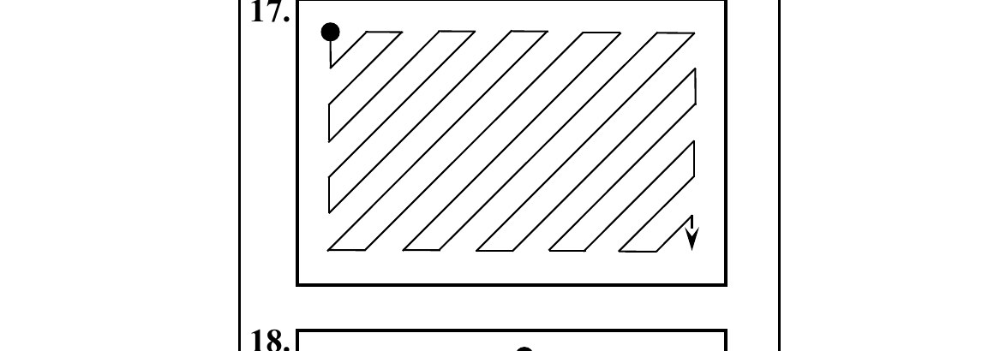

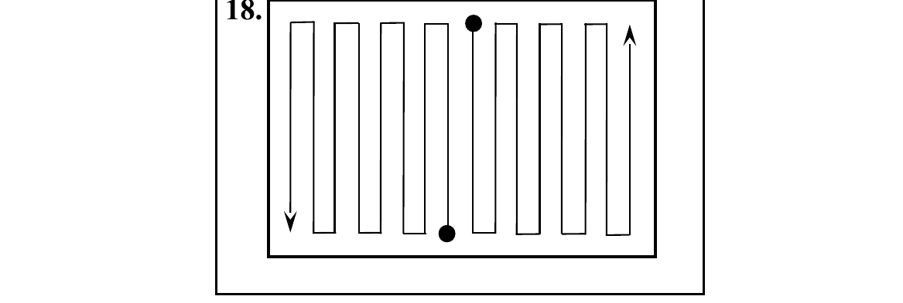

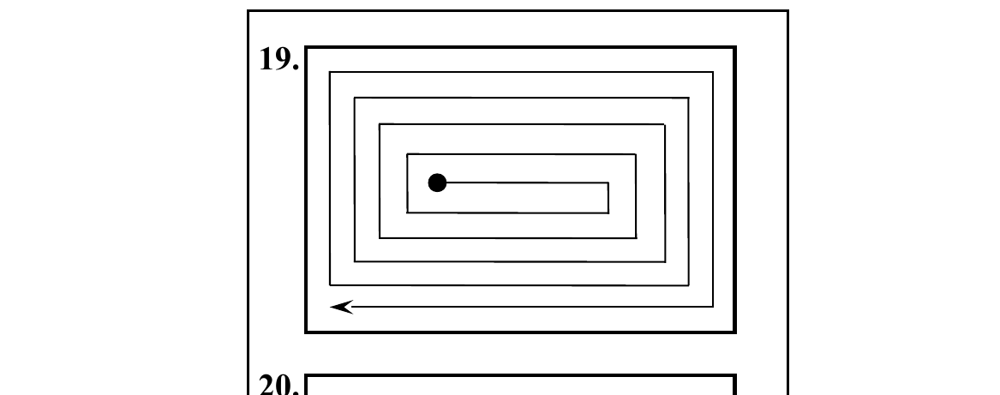

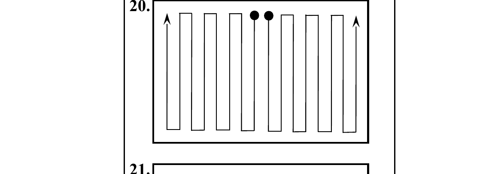

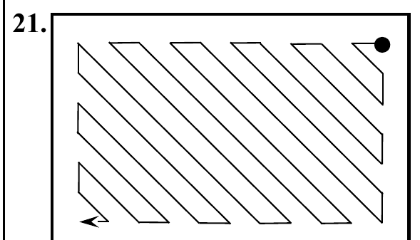

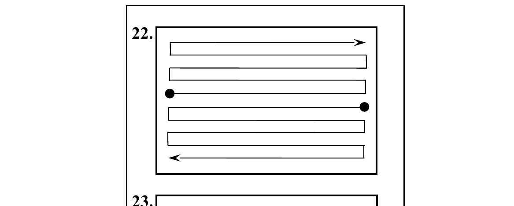

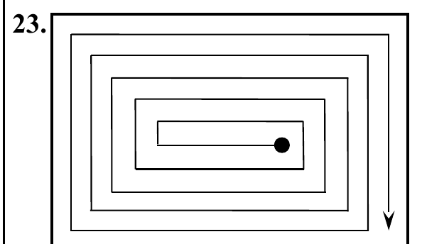

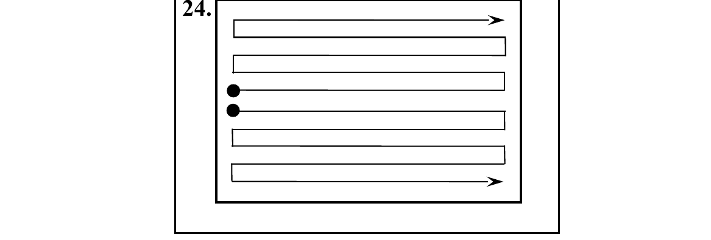

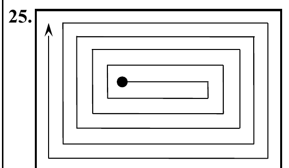

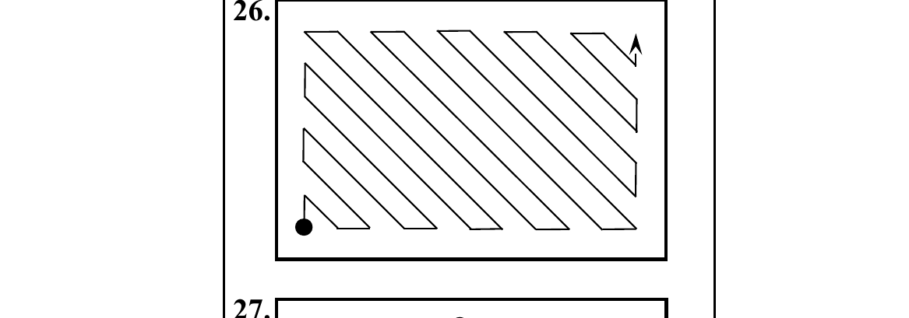

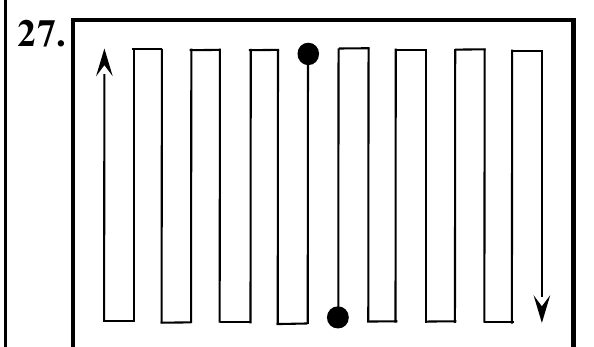

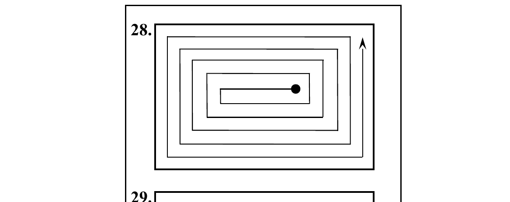

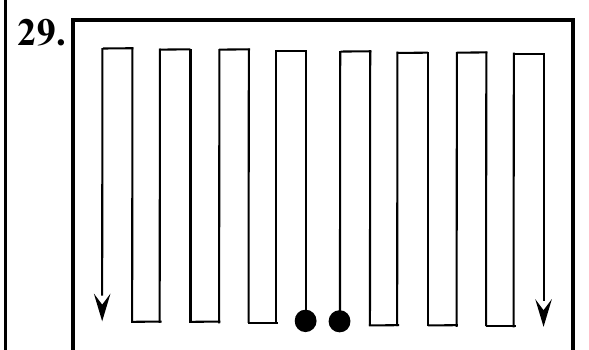

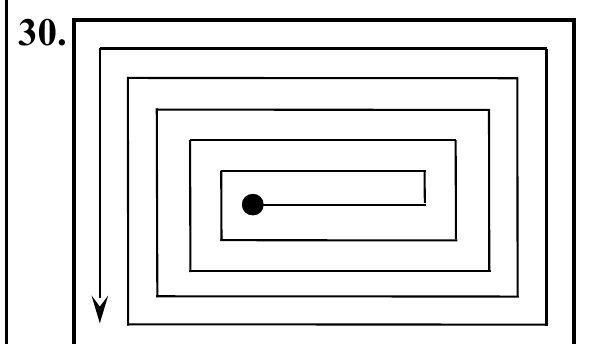

---

*(кінець документа)*
